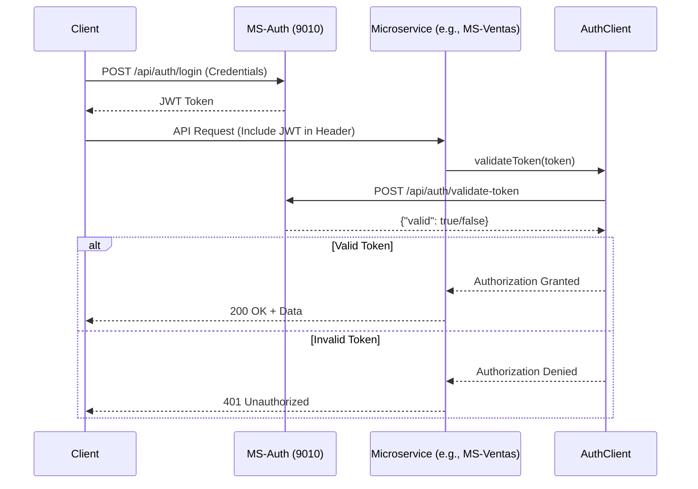

# Microservices Architecture Documentation  


**A scalable, secure, and domain-driven microservices system built with Spring Boot and Java 21.**  

---
## 🏗️ Project Structure  
```plaintext
.
├── ms-auth/           # Authentication & JWT (Port 9010)
├── ms-usuarios/       # User & Role Management (Port 9011)
├── ms-ventas/         # Sales Processing (Port 9013)
├── ms-proveedor/      # Supplier Management (Port 9014)
├── ms-productos/      # Product Catalog (Port 9015)
├── ms-sucursal/       # Branch Management (Port 9016)
└── ms-inventario/     # Real-Time Inventory Tracking (Port 9017)
```

---

## 🛠️ Technologies  
| Technology           | Version           | Purpose                                |  
|----------------------|-------------------|----------------------------------------|  
| **Java**             | 21                | Core Language                          |  
| **Spring Boot**      | 3.4.5             | Framework for Microservices            |  
| **Spring Security**  | 6.2.3             | Authentication & Authorization        |  
| **JWT (Auth0)**      | 0.12.6            | Token-Based Security                   |  
| **MySQL**            | 8.0               | Relational Database                    |  
| **Spring Data JPA**  | 3.2.4             | Data Persistence                       |  
| **Lombok**           | 1.18.30           | Boilerplate Reduction                  |  
| **ModelMapper**      | 3.2.2             | DTO ↔ Entity Mapping                   |  
| **SpringDoc OpenAPI**| 2.8.5             | API Documentation                      |  

*Dependencies managed via [Maven](https://maven.apache.org/).*  

---

## 🗃️ Database Configuration  
### MySQL Setup for `MS-Usuarios`  
**Configuration File:** `src/main/resources/application.yml`  
```yaml
spring:
  datasource:
    url: jdbc:mysql://localhost:3306/perfumalandia_spa?allowPublicKeyRetrieval=true&useSSL=false
    username: root
    password: 1290
    driver-class-name: com.mysql.cj.jdbc.Driver
  jpa:
    database-platform: org.hibernate.dialect.MySQL8Dialect
    hibernate:
      ddl-auto: update
    properties:
      hibernate:
        dialect: org.hibernate.dialect.MySQL8Dialect
        allow-circular-references: true
```

**Key Features:**  
- **Auto-Schema Update**: `ddl-auto: update` ensures schema evolves with code changes.  
- **Security**: SSL disabled for local development (enable in production).  
- **Compatibility**: Uses `MySQL8Dialect` for full MySQL 8.x support.  

---

## 🔐 Authentication Flow  
### JWT Token Validation Process  


---

## 🚀 Deployment  
### Run a Microservice Locally  
```bash
mvn clean install
mvn spring-boot:run -Dspring-boot.run.arguments="--server.port=<PORT>"
```

**Example for MS-Usuarios:**  
```bash
mvn spring-boot:run -Dspring-boot.run.arguments="--server.port=9011"
```

### Environment Variables  
| Variable               | Example Value       | Description                |  
|------------------------|---------------------|----------------------------|  
| `SPRING_DATASOURCE_URL`| JDBC MySQL URL      | Database Connection URL    |  
| `SPRING_DATASOURCE_USER`| root               | Database Username          |  
| `SPRING_DATASOURCE_PASSWORD`| 1290         | Database Password          |  

---

## ✅ Best Practices  
- **Decentralized Authentication**: Token validation centralized in `MS-Auth`.  
- **API-First Design**: Documented via SpringDoc OpenAPI (`/swagger-ui.html`).  
- **Modularity**: Independent scaling of services (e.g., scale `MS-Ventas` during peak sales).  
- **Security**: JWT encryption, RBAC via Spring Security.  

---

🔗 **More Information?**  
[](https://deepwiki.com/ByAncort/perfumeria-backend)
